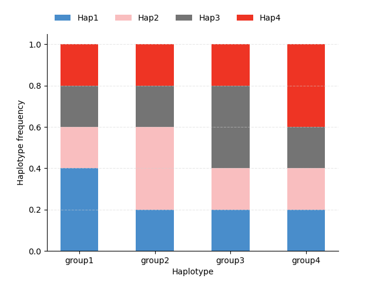
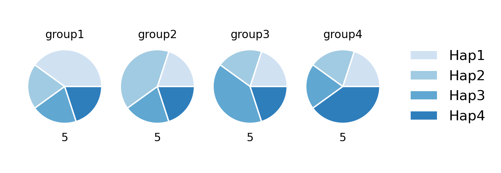
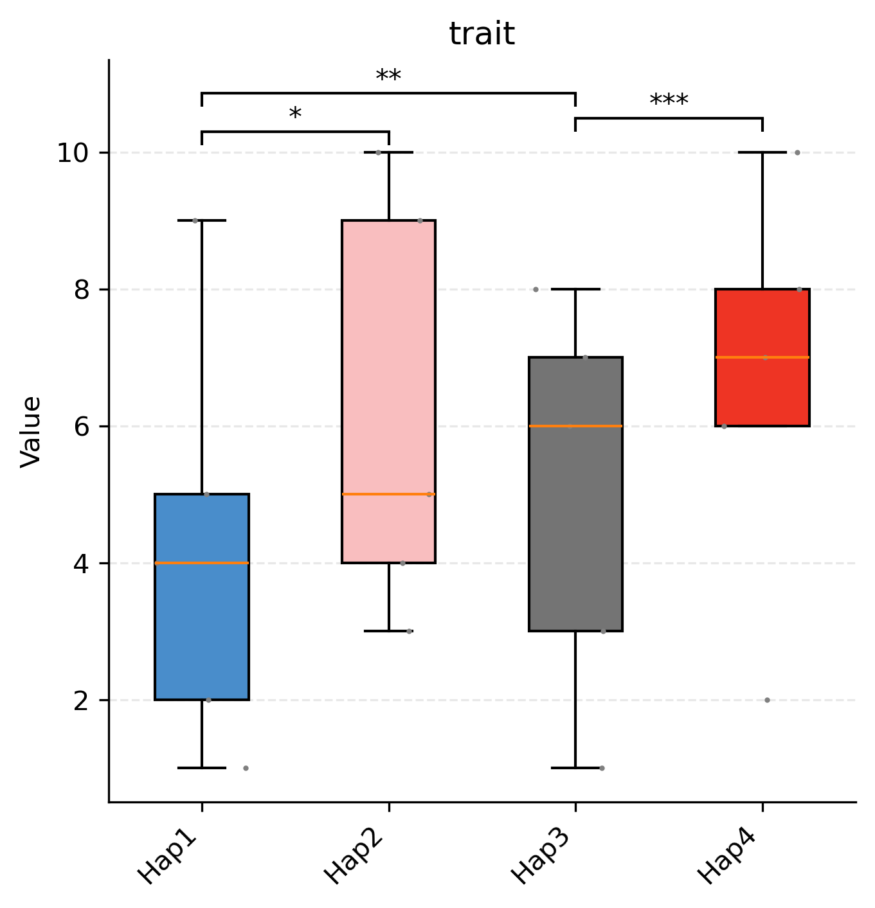
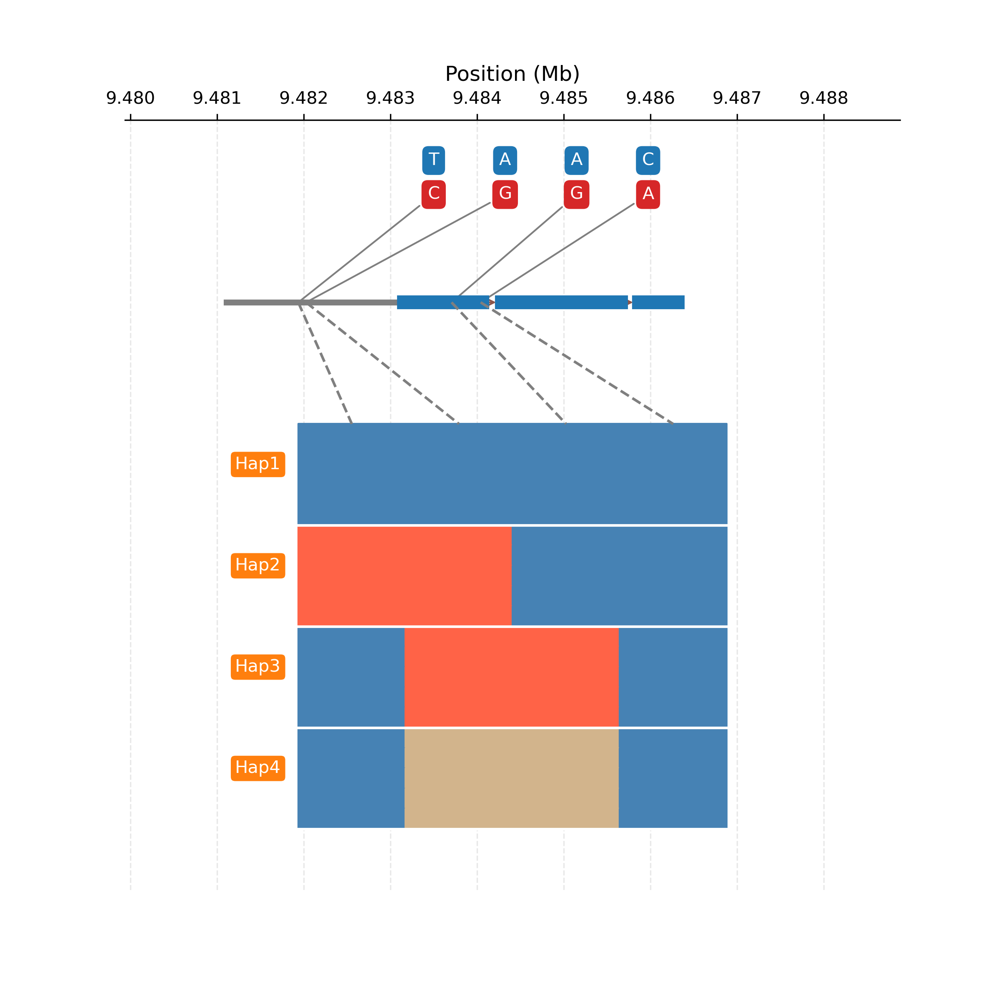

## hastat
[](https://doi.org/10.5281/zenodo.11183815)

### Description
A python library to perform gene haplotypes analysis in natural populations.

### Features
main modules:
- [x] `view` view genotype, haplotype, pi, fst, ld data of interested genes in a VCF file
- [x] `stat` perform haplotype statistic analysis with multiple phenotype using anova and multiple comparison
- [x] `plot` plot haplotype data using HapBox, HapBar, HapPie, HapNetwork, Gene, etc.
- [x] `gwas` perform gwas analysis using wrapper of gemma, plink, etc.


### Requirements
Python 3.9 or higher and the following packages are required:
- pandas
- numpy
- scipy
- statsmodels
- scikit-allel
- gffutils
- pysam
- matplotlib
- tomli
- prettytable

### Installation

```bash
git clone https://github.com/swu1019lab/hastat.git
cd hastat
# install the package using build commands (recommended)
pip install build --user
python -m build
pip install dist/hastat-0.0.6.tar.gz --user
# or
# install the package using setup.py install command
python setup.py install --user
```

### Usage
```bash
usage: hastat [-h] [--version] [--log LOG] {view,stat,plot,gwas} ...

A package for gene haplotype analysis

optional arguments:
  -h, --help            show this help message and exit
  --version             show program's version number and exit
  --log LOG             The log file name (default: stdout)

subcommands:
  valid subcommands

  {view,stat,plot,gwas}
                        additional help
    view                View the haplotypes data of a gene or target region
    stat                Perform statistical analysis on the haplotypes of a gene
    plot                Plot the haplotypes data of a gene
    gwas                Perform GWAS analysis using GEMMA/EMAX wrapper
```

### Example
#### 🏷️ 1. view the genotype or haplotypes data of a gene
```bash
hastat view -v test.vcf -i gene_id -t hap_group -o hap_groups.csv
```
the `hap_groups.csv` file will contain the haplotype data of the gene with the following format:
```csv
samples,haplotypes
sample1,Hap1
sample2,Hap2
sample3,Hap3
sample4,Hap4
sample5,Hap1
sample6,Hap2
sample7,Hap3
sample8,Hap4
```
other options can be found by running `hastat view -h`:

```bash
usage: hastat view [-h] -v VCF [-a GFF] (-r REGION | -i GENE_ID) [-t {genotype,hap_table,hap_group,hap_freq}] [-g GROUP] [-o OUT]

optional arguments:
  -h, --help            show this help message and exit
  -v VCF, --vcf VCF     The VCF file containing the genotype data
  -a GFF, --gff GFF     The GFF file containing the gene annotation
  -r REGION, --region REGION
                        The region of the gene to be analyzed, format: chr:start-end
  -i GENE_ID, --gene_id GENE_ID
                        The gene ID for the target region
  -t {genotype,hap_table,hap_group,hap_freq}, --type {genotype,hap_table,hap_group,hap_freq}
                        The data type to be analyzed (default: hap_group)
  -g GROUP, --group GROUP
                        A csv file containing the custom groups of samples if the data type is hap_group
  -o OUT, --out OUT     The output csv file name (default: stdout)
 ```
#### 🏷️ 2. perform haplotype statistic analysis
```bash
hastat stat -g hap_groups.csv -p sample_phe.csv -o hap_stat.csv
```
the `hap_groups.csv` file will contain the haplotype groups of the gene with the following format:
```csv
samples,haplotypes
sample1,Hap1
sample2,Hap2
sample3,Hap3
sample4,Hap4
sample5,Hap1
sample6,Hap2
sample7,Hap3
sample8,Hap4
```
the `sample_phe.csv` file will contain the phenotype data of the gene with the following format:
```csv
samples,trait
sample1,5
sample2,3
sample3,7
sample4,2
sample5,9
sample6,4
sample7,6
sample8,8
```

the `hap_stat.csv` file will contain the haplotype statistic data of the gene with the following format:
```csv
group1,group2,meandiff,p-adj,lower,upper,reject,pheno,annotate,anova,count1,count2,mean1,mean2
Hap1,Hap2,2.0,0.7269,-3.4809,7.4809,False,trait,gene,0.6503121273263954,5.0,5.0,4.2,6.2
Hap1,Hap3,0.8,0.9747,-4.6809,6.2809,False,trait,gene,0.6503121273263954,5.0,5.0,4.2,5.0
Hap1,Hap4,2.4,0.6041,-3.0809,7.8809,False,trait,gene,0.6503121273263954,5.0,5.0,4.2,6.6
Hap2,Hap3,-1.2,0.9221,-6.6809,4.2809,False,trait,gene,0.6503121273263954,5.0,5.0,6.2,5.0
Hap2,Hap4,0.4,0.9966,-5.0809,5.8809,False,trait,gene,0.6503121273263954,5.0,5.0,6.2,6.6
Hap3,Hap4,1.6,0.837,-3.8809,7.0809,False,trait,gene,0.6503121273263954,5.0,5.0,5.0,6.6
```
other options can be found by running `hastat stat -h`:
```bash
usage: hastat stat [-h] -g GROUP -p PHENO [-s MIN_HAP_SIZE] [-a ANNOTATE] [-m {TukeyHSD,AllPairTest}] [-o OUT]

optional arguments:
  -h, --help            show this help message and exit
  -g GROUP, --group GROUP
                        A csv file containing the haplotype groups of samples
  -p PHENO, --pheno PHENO
                        A csv file containing the phenotype data of samples
  -s MIN_HAP_SIZE, --min_hap_size MIN_HAP_SIZE
                        The minimum sample size for each haplotype (default: 10)
  -a ANNOTATE, --annotate ANNOTATE
                        The annotation of haplotypes (default: gene)
  -m {TukeyHSD,AllPairTest}, --method {TukeyHSD,AllPairTest}
                        The method for multiple comparisons (default: TukeyHSD)
  -o OUT, --out OUT     The output csv file name (default: stdout)
```
#### 🏷️ 3. plot the haplotype data of a gene
```bash
hastat plot -t bar -c bar.toml
```
<div style="display: flex; justify-content: center;">
  
</div>

```bash
hastat plot -t pie -c pie.toml
```
<div style="display: flex; justify-content: center;">
  
</div>

```bash
hastat plot -t box -c box.toml
```
<div style="display: flex; justify-content: center;">
  
</div>

other options can be found by running `hastat plot -h`:
```bash
usage: hastat plot [-h] -t {bar,pie,box,network} -c CONFIG

optional arguments:
  -h, --help            show this help message and exit
  -t {bar,pie,box,gene,network}, --type {bar,pie,box,gene,network}
                        The plot type
  -c CONFIG, --config CONFIG
                        The configuration file for plotting
```
```bash
hastat plot -t gene -c gene.toml
```
<div style="display: flex; justify-content: center;">
  
</div>

#### 🏷️ 4. perform GWAS analysis


### Citation
If you use hastat in your research, please cite the following paper:

> Xiaodong Li, & Kun Lu. (2024). hastat: a python library to perform gene haplotypes analysis in natural populations. Zenodo. https://doi.org/10.5281/zenodo.11183815